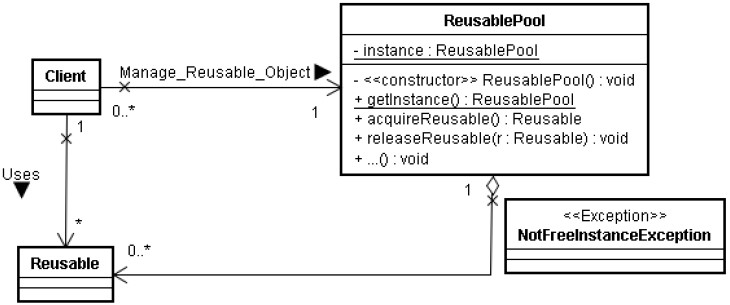

poolobject
==========

 

Java code example of creational design pattern pool object

Workshop to use good practices in software developmemnt: testing and measurement.

Authors:

- Carlos Lopez Nozal
- Jesus Alonso Abad

# Practica 1

## Autores:
- Claudia Landeira Viñuela
- Jonás Martínez Sanllorente

## Enunciado
En la práctica se va a simular un pequeño desarrollo de un producto software para realizar mediciones sobre él.
Establecer un caso de estudio que sirva para caracterizar y evaluar tanto el producto desarrollado como el proceso seguido.

## Objetivo
- Comprender los objetivos de medición relacionados con la caracterización y la evaluación de productos, procesos y recursos software.
- Comprender, aplicar y analizar técnicas de medición sobre entidades de productos software relacionados con conjuntos de pruebas de software.
- Comprender, aplicar y analizar medidas relacionadas sobre entidades de proceso y recursos de prueba del software.

## Proceso de realizacion de las pruebas
El proceso de desarrollo de la barería de pruebas se va a gestionar utilizando el control de versiones del sistema Git proporcionado por el repositorio de proyectos GitHub.
Los pasos para gestionar el proceso son los siguientes:
1. Cada miembro del equipo tiene que estar registrado en GitHub y Codecov.io.
2. Uno de los miembros tiene que realizar un fork del repositorio donde se encuentra el código que se quiere probar `https://github.com/clopezno/poolobject`. El nuevo repositorio tiene que ser público.
3. Invitar al resto de miembros del equipo para que puedan participar en el desarrollo de las pruebas.
4. Vincular el proyecto con Codecov.io.
5. Cada nuevo test realizado ejecutar un commit/push al repositorio del grupo. El texto del commit tiene que describir el caso de prueba añadido.
6. Verificar el resultado de las pruebas en el pipeline de integración continua y cómo la calidad del producto va mejorando con las sucesivas integraciones.

## Requisitos

### Teóricos
- Conocimiento del proceso de prueba y sus tareas asociadas.
- Conocimiento de métricas de producto y de proceso.
- Conocimiento de patrón de diseño Pool Object.
- Conocimiento de repositorios de proyectos software.
- Conocimiento de sistemas de control de versiones.
- Conocimiento de sistemas que permitan la ejecución de tareas dle proceso de desarrollo software.
- Conocimiento de sistemas integración continua.

### Software
- Eclipse IDE for Java Developers.
- Plugin Eclipse EclEmma.
- Estar registrado con el nombre usuario de la UBU en repositorio de proyectos GitHub.
- Estar registrado con la cuenta de GitHub en Codecov.io.

### Técnicos
- Manejo de entorno de desarrollo Eclipse y componentes adicionales (plugins).
- Compilar, ejecutar pruebas y desplegar la aplicación con Apache Ant.
- Desarrollo de proyectos software con el sistema de control de versiones Git.
- Automatización de casos de prueba con JUnit4.
- Cobertura del código con las pruebas usando EclEmma, JaCoCo y Codecov.io.

# Pool Object

## Sinopsis/Propósito
Gestionar la reutilización de objetos cuando un tipo de objetos es costoso de crear o sólo se puede crear un número limitado de objetos.´
### Fuerzas
- Un programa sólo puede crear un número limitado de instancias para una clase en particular.
- Si la creación de instancias de una clase es muy cosatosa, se debería evitar la nueva creación de instancias.
- Un programa puede evitar crear nuevos objetos reutiliazándolos cuando ellos han terminado su función en vez de tirarlos a la papelera (garbage).

## Solución

### Estructura

### Participantes

#### Reusable
Las instancias de clases en este rol colaboran con otros objetos durante un tiempo limitado. Después, ellas no son necesarias para la colaboración.

#### Client
Las instancias de clases en este rol usan los objetos de tipo `Reusable`

#### ReusablePool
Las instancias de clase en este rol gestionan la creación y obtención de objetos `Reusable` para ser usados por el objeto `Client`. Normalmente es deseable mantener todos los objetos `Reusable` que no se encuentran actualmente en uso en el mismo almacén para mantener una política coherente. Por ello, `ReusablePool` esta diseñada como una clase `Singleton`. La política concreta utilizada en este ejemplo es mantener dos instancias de la clase `Reusable`. En el caso de recibir una petición y no existir instancias disponibles lanza una excepción `NotFreeInstanceException`

### Colaboraciones
Un objeto `Client` invoca a `ReusablePool.acquireReusable()` cuando necesite un objeto `Reusable`. Cuando el `Client` deja de utilizar el objeto invoca el método `ReusablePool.releaseReusable(Reusable)` pasando como parámetro el objeto a liberar. La política de asignación y liberación de objetos `Reusable` esta implementada en `ReusablePool` (número de instancias de objetos `Reusable`, que hacer en el caso de recibir una petición y no existir instancias disponibles...).

## Covertura de las pruebas

### Covertura de las pruebas con EclEmma

## Especificacion textual

### Proceso

#### setUp()

#### tearDown ()

#### testGetInstance()

#### testAcquite Reusable()

#### testTealeaseReusable()

## Preguntas
1. ¿Se ha realizado trabajo en equipo?
2. ¿Tiene calidad el conjutno de pruebas desponibles?
3. ¿Cuál es el esfuerzo invertido en realizar la actividad?
4. ¿Cuál es el número de fallos encontrados en el código?
